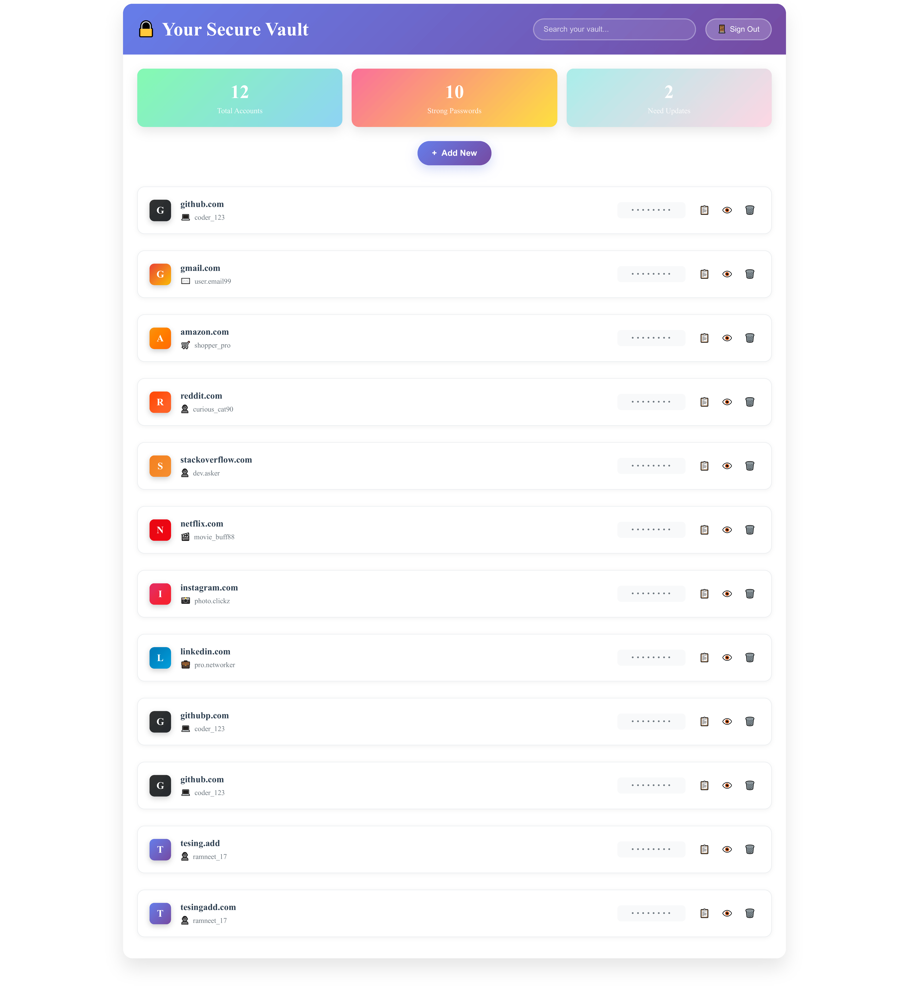

# 🔐 Secure-Pass

Secure-Pass is a personal and team-friendly password manager built with a focus on security, usability, and full control. It features a clean UI, strong encryption, and no reliance on third-party password storage services.

## 🚀 Features

- 🔒 AES-encrypted password storage with a master PIN
- 👤 User authentication
- 🧾 Add, view (with toggle), copy, and delete credentials
- 🔍 Real-time search and filtering
- 📊 Dashboard with metrics (total accounts, strong/weak passwords, outdated entries)
- 🧪 Responsive Angular UI using standalone components
- ⚙️ Spring Boot backend with secure REST APIs
- 🐘 PostgreSQL as the primary database
- 🐳 Dockerized architecture for easy deployment

## 🖼️ UI Preview



## 🛠️ Tech Stack

- **Frontend**: Angular (standalone components)
- **Backend**: Spring Boot (Java)
- **Database**: PostgreSQL
- **DevOps**: Docker

## 📦 Installation & Setup

```bash
# Step 1: Clone the repository
git clone https://github.com/Ramneet-17/Secure-Pass.git
cd Secure-Pass

# Step 2: Set up environment variables
# Create a file named `.env` in the root directory with the following content:

POSTGRES_URL=jdbc:postgresql://postgres:5432/securepassdb
POSTGRES_USER=your_username
POSTGRES_PASSWORD=your_password
POSTGRES_DB=securepass

# Step 3: Build and run all services using Docker Compose
docker-compose up --build


# Step 4 : Run Angular frontend separately in development mode
cd frontend
npm install
ng serve

# The frontend will be available at: http://localhost:4200
